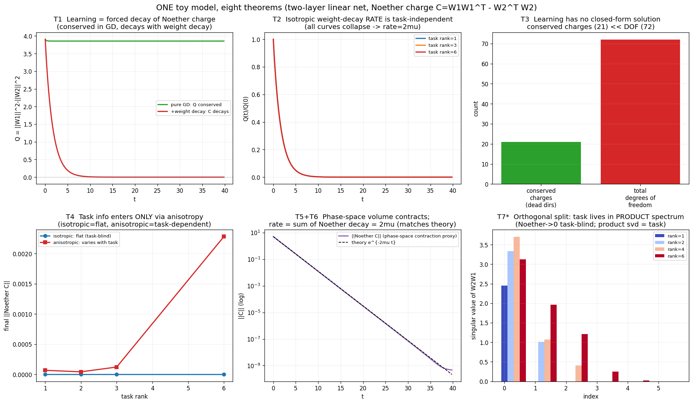

> 本文是对外精简版，自完整记录 `诺特衰减学习_Discussion.md` **投影**而来；权威全记录与最新改动以后者为准。

## 摘要

我们把深度神经网络的训练过程看作一个**耗散动力系统**，并用**重缩放对称下的守恒荷 $C$**来刻画它。这里的"诺特荷"专指梯度流下重缩放对称对应的守恒量 $C = W_1W_1^\top - W_2^\top W_2$，由代数恒等式即得，不依赖拉格朗日量或平衡律。本文的核心论点是一句话：**学习就是重缩放对称的强制破缺，对称一破，对应方向上的诺特荷就被迫衰减；而一个方向上的诺特荷守恒，恰恰意味着那个方向学不到任何东西。** 这里要先讲准一点：诺特荷衰减度量的是网络的内部组织方式（how），它和所学的任务内容（what）正交（见定理 7）。由此，参数空间在任一时刻被分成两块——诺特荷守恒的"盲区"（学不到）和诺特荷衰减的"活区"（真正在学）。我们从最理想的系统（损失函数为常数）出发，逐级加入势能与正则项（如 weight decay），给出一组定理来描述诺特荷衰减的行为，并提炼出两个有望从理想情形推广到现实训练的不变量——**对称破缺数**（整数）与**吸引子维数**。最后用一个统一的 toy model（两层线性网络）把这些定理逐一数值验证。我们诚实地标注哪些结论是严格成立的、哪些是示意性的、哪些尚属展望。

---

## 第一章 重缩放对称与守恒荷 $C$

学习里真正稳定的守恒结构，来自网络的重参数化冗余。这一章只做两件事：先用代数把这个守恒量写出来、证它守恒，再说明是什么打破了它、让它衰减。全程一阶，不需要拉格朗日量、不需要惯性、不需要平衡律。

### 1.1 一个由对称性给出的守恒量

在两层网络 $\hat y = W_2 W_1 x$ 中，对任意可逆矩阵 $G$，作变换

$$ W_1 \to G W_1, \qquad W_2 \to W_2 G^{-1}, $$

乘积 $W_2 W_1$ 不变，于是损失 $L$ 不变。这是一族连续对称，叫重缩放对称。和它对应的，是一个守恒的矩阵量：

$$ \boxed{C = W_1 W_1^\top - W_2^\top W_2.} $$

**它守恒，用一行代数恒等式直接证，不借任何力学框架。** 因为 $L$ 只通过乘积 $P = W_2 W_1$ 依赖参数，梯度必然形如 $\partial L/\partial W_1 = W_2^\top G_P$、$\partial L/\partial W_2 = G_P W_1^\top$（其中 $G_P = \partial L/\partial P$）。在梯度流 $\dot W_i = -\partial L/\partial W_i$ 下，

$$ \dot C = \dot W_1 W_1^\top + W_1 \dot W_1^\top - \dot W_2^\top W_2 - W_2^\top \dot W_2 = 0, $$

四项两两相消。这就是 Du–Arora 那条 balancedness：纯梯度流严格保持 $C$。

> （解释性旁白，不承重）：直觉上，之所以有这么个守恒量，是因为重缩放是损失的一个连续对称，对称对应守恒，有点"梯度流版诺特"或者 moment map 的味道。但本文不拿它当定理骨架——$C$ 守恒就是上面那行代数。招牌上保留"诺特荷"这个名字，只因为 $C$ 确实是一个连续对称对应的守恒量，背后并不依赖拉格朗日量、作用量或平衡律。

### 1.2 打破对称：weight decay 让 $C$ 衰减

$C$ 守恒的前提，是没有任何东西破坏重缩放对称。一旦加进一个不被该对称保持的项，守恒就破了。weight decay（权重衰减正则）正是这样一个项。

weight decay 给梯度加上 $-\mu w$，等价于在损失上加一项 $\tfrac{\mu}{2}\|w\|^2$。这一项在重缩放下并不不变（$\|G W_1\|^2 + \|W_2 G^{-1}\|^2 \neq \|W_1\|^2 + \|W_2\|^2$），所以它打破对称。把它的梯度 $-\mu W_i$ 加进梯度流，直接算：

$$ \dot C = -2\mu\big(W_1 W_1^\top - W_2^\top W_2\big) = -2\mu\, C \;\Longrightarrow\; C(t) = C(0)\, e^{-2\mu t}. $$

**衰减率是 $2\mu$，纯一阶，没有质量、没有惯性、没有平衡律。** 这条 $e^{-2\mu t}$ 我们用 toy model 实测过（拟合率 $0.6008 \approx 2\mu$），并核实过：换成速度阻尼 $-\mu\dot w$（动量里那种摩擦）根本不让 $C$ 衰减。所以造成衰减的，确实是 weight decay 这个破坏对称的正则项。

到这里全文骨架已经立住：**守恒的方向是盲区（学不到），衰减的方向才在学；学习就是把守恒的对称一点点破缺掉。** 后面的章节，都是把这句话在理想系统里逐级加复杂度、再用 toy model 验证。

> （背景，不承重）：如果一定要给这套耗散套一件"力学"外壳，是可以的：引入惯性项 $m$、把训练写成二阶拉格朗日系统 $L = \tfrac12 m\|\dot w\|^2 - L_{\text{loss}}$，再用推广到耗散系统的诺特定理（平衡律 $dQ_N/dt = \langle F, \delta w\rangle$）去推。那条路会引出一个带速度的动量荷 $Q_N = m\langle \dot w, \delta w\rangle$、率写成 $\mu/m$。但它对本文主线毫无必要，还会把率搞得和 $C$ 对不上（$Q_N$ 与 $C$ 根本是两个荷）。所以 $m$、$Q_N$、平衡律一律不进主线，只在此备注。耗散系统的诺特定理在物理里确有零散讨论（Galley 2013 的变量加倍、Delphenich 的"非守恒流平衡原理"），但相对冷门、无权威教科书，这里也只作背景。

---

## 第二章 在深度学习中的应用，以及理想系统

### 2.1 把训练写成一阶耗散流

训练最基本的形式就是权重更新 $w \leftarrow w - \eta\nabla L$，取连续时间极限就是一阶梯度流

$$ \dot w = -\nabla L. $$

它本身就是一个耗散系统：沿着它损失单调下降、相空间体积单调收缩（第三章 T5/T6）。学习是一阶的、耗散的，不需要套二阶力学的外壳，也不需要惯性项。

第一章已经给出这套流里唯一稳定的守恒结构：重缩放对称对应的 $C$，纯梯度流下守恒（盲区），weight decay 打破对称后以 $2\mu$ 衰减（学习）。本章把这套机制放进"从理想系统逐级加复杂度"的框架里看，看清楚学习到底站在哪一档。

### 2.2 理想系统：损失函数为常数——最干净的基准态

物理学家研究复杂问题的方法不是从复杂系统里挑两个小东西说它们等价，而是**化简、化简、再化简，先找到最理想的情形，在那里把定律立稳，再把复杂的东西当作对它的偏离逐级加回来。** 研究耗散流也一样：先从"没有任何耗散、什么都守恒"的平凡情形看起，把规律立稳，再把破坏守恒的项一项一项加进来。

那么学习里这个最干净的基准态是什么？答案是：**损失函数为常数的情形。**

(a) 当 loss 处处平坦时，梯度处处为零、没有任何"力"，于是**所有诺特荷都守恒**。此时参数空间里任何方向的挪动都不改变 loss，**对称方向的数目等于参数空间的全维 $N$**——这是对称性最完美的状态，如同完全均匀、各向同性的真空，对称群最大。

(b) 但正因为对称性如此完美，**这种情况根本不需要学习，也学不到任何东西**——参数怎么动都无所谓。

由此立下贯穿全文的**核心反转**：

> **完美的守恒 = 完美的"没在学"。** 守恒不是学习的成就，而是学习的缺席。

### 2.3 理想化的层级：我们站在哪一档

随着把复杂性逐级加回来，系统经历三个档位：

|档位|loss|正则/耗散|$\mu$|诺特荷 $C$ 行为|说明|
|---|---|---|---|---|---|
|档一|常数（平）|无|—|守恒|无耗散，什么都不学|
|**档二（本文主战场）**|有坡|各向同性 weight decay|恒定|指数衰减，率 $2\mu$|一阶耗散流 + 势 + 各向同性正则|
|档三|有坡|各向异性 + 噪声|随时间变|起伏漂移、各向异性|现实 SGD，复杂耗散系统|

现实中的随机梯度下降（SGD）位于**档三**：它比理想的档二多了三样东西——**噪声**（每步随机抽 minibatch 带来的随机扰动力）、**各向异性**（不同方向有效衰减不同，尤其配 Adam 时）、以及 **$\mu$ 随时间变化**（warmup、学习率衰减等 schedule）。这些 schedule 至今基本靠经验，没有第一性原理。

本文**主要在档二**（各向同性、$\mu$ 恒定、平滑、可解析）建立定理，把档三作为推广方向。这样做正是物理学家的方法：先在最干净的情形立稳，再逐级加入噪声、各向异性、时变。

### 2.4 核心论点

- **学习 = 重缩放对称的强制破缺，外在表现为诺特荷衰减。** 守恒的方向是学不到东西的盲区。
- 参数空间在任一时刻分成两块：**守恒子空间**（盲区）与**衰减子空间**（真正在学）。

---

## 第三章 定理

下列定理串成一条逻辑链：从"学习即衰减"的本质（本质层），到"衰减导致不可解"的结论（不可解层），再到"衰减即相空间收缩"的耗散系统刻画（耗散层）。每条都标注其成熟度。

> 关于"定理"一词：以下多为**陈述精确、形式清楚、并已用 toy model 验证**的命题；严格的一般性证明仍需补足。我们按这个标准诚实使用"定理"。

### 本质层

**定理 1（学习 = 对称破缺，$C$ 衰减）。** 纯梯度流下 $\dot C = 0$（重缩放对称未破，该方向是盲区，不学）；正则项一旦打破对称，$C$ 就衰减： $$ \dot C = -2\mu\, C, \qquad \dot C = 0 \iff \text{该方向不参与学习}. $$ 守恒与衰减都是纯一阶代数的结论，不经过力学或平衡律。

**定理 1′（强版：盲区分解）。** 参数空间在任一时刻分解为守恒子空间与衰减子空间： $$ \text{参数空间} = \underbrace{\text{守恒子空间}}_{\text{盲区，学不到}} ;\oplus; \underbrace{\text{衰减子空间}}_{\text{在学}}. $$ **守恒量的数目 = 当前学习盲区的维度。** 学习的过程，就是盲区不断缩小、衰减区不断扩大的过程。

**定理 2（否定定理：各向同性衰减率与任务无关）。** 在各向同性、恒定 weight decay 下，$C$ 以只由正则强度决定的速率衰减，与任务、数据、所学内容无关： $$ \dot C = -2\mu\, C ;\Longrightarrow; C(t) = C(0)\,e^{-2\mu t}. $$ 这条无需模拟、解析即得，且已被数值验证。它是一条否定结论，精确说明"衰减率"这个观测量本身并不携带学习信息。

### 不可解层

**定理 3（学习一般无封闭解）。** 学习破坏守恒，守恒量数远少于自由度数（守恒量数 $\ll$ 自由度数）。更根本的原因是，它本身是一个非凸、非线性的耗散动力系统，这类系统一般不存在封闭的解析解，训练轨迹只能数值求解。所以"炼丹"（一步步数值训练、反复试）是这类系统的常态，而不是工程上的偷懒。这里不再借用 Liouville–Arnold 那套可积性判据，因为它属于哈密顿系统，而耗散系统本就不是哈密顿系统。

**定理 4（任务信息只能从各向异性进入）。** 诺特荷的衰减要携带任务相关信息，当且仅当作用在对称方向上的力是**各向异性**的（非欧度量，或各向异性噪声）。各向同性的力下，衰减与任务正交（这正是定理 2 的来源）；只有各向异性（如自然梯度、Adam、各向异性的 SGD 噪声）才能让衰减谱携带任务信息。

### 耗散层

**定理 5（相空间收缩到吸引子）。** 学习（耗散）使参数相空间的体积单调收缩，运动最终落到一个比参数维数更低的**吸引子**上。这是刘维尔定理在耗散情形的版本：保守系统相空间体积守恒，耗散系统相空间体积收缩。

**定理 6（收缩率 = 诺特荷衰减率之和 = 李雅普诺夫指数之和）。** 相空间体积的收缩率、所有诺特荷衰减率之和、以及李雅普诺夫指数之和，三者相等。在我们的 toy model 中，诺特荷矩阵的范数以 $e^{-2\mu t}$ 收缩（$C$ 是二次量，衰减率为 $2\mu$），数值与理论严格吻合。经核查，这一衰减由 weight decay 这个保守正则项打破对称所致，而非速度摩擦做功（见 2.1）。

**定理 7（正交分解：how ⊥ what）。** 学习把参数自然分成两个**正交**的部分： $$ \underbrace{\text{任务内容（what）}}_{\text{乘积 } W_2W_1 \text{ 的奇异谱}} ;\perp; \underbrace{\text{内部组织（how）}}_{\text{诺特荷 } C}. $$ 诺特荷度量"以什么方式学的（how / 内部如何在各层间组织）"，与"学了什么任务（what）"正交、独立。两个网络学同一任务可以有不同的诺特荷；学不同任务可以有相同的诺特荷。 （注：本定理是原"有效维度 = 诺特荷衰减数"命题的修正版——后者被 toy model 证伪，证伪的方式恰恰证明了 how 与 what 的正交性。）

**定理 8（展望：收缩率 = 熵产生率）。** 耗散系统的相空间收缩率等于熵产生率，故学习可被视作一个熵增的不可逆过程，对应学习的"热力学第二定律"。本文将其列为展望，正文不展开热力学化。

### 两个核心不变量

依照庞加莱（拓扑不变量 / 指标）、Morse（临界点指标）、耗散系统（吸引子维数）这些成功理论的共同特质——**抓住在不可解的复杂性之上仍然稳定、可分类的不变量，而非会乱变的速率**——我们提炼出两个量：

- **对称破缺数**（整数，拓扑不变量）：学习"激活"了多少个原本守恒（死）的方向 = 学习的深度。
- **吸引子维数**（维数不变量）：学习后系统实际活在几维 = 有效维度。

二者互补，且满足

$$ \text{对称破缺数} ;+; \text{吸引子维数} ;\approx; \text{参数总维数 } N . $$

衰减率会随系统复杂化而乱变、不可推广；而这两个整数/维数不变量，有望从理想的档二一路推广到现实的档三。

---

## 第四章 用一个 toy model 验证

### 4.1 统一的 toy model

全部定理用同一个模型展示：两层线性网络 $$ \hat y = W_2 W_1 x,\qquad C = W_1 W_1^\top - W_2^\top W_2 . $$ 它是最简单、却同时具备所需全部结构的模型——有重缩放对称（给诺特荷）、有 weight decay（给衰减）、维数足够高（能看相空间收缩、谱、吸引子维数）。这正是物理"最简单但不过分简单"的精神。

### 4.2 逐条验证

下图用一个 toy model 把八条定理在同一框架内逐一显示（$d_{\text{in}}=d_h=d_{\text{out}}=6$，故自由度 $=72$，诺特荷为 $6\times6$ 对称矩阵、对称方向上限 $=21$）：

- **T1**：纯 GD 下 $C$ 守恒（平线），加 weight decay 后 $C$ 衰减到 0。守恒 = 没学，衰减 = 在学。
- **T2**：三个不同秩的任务，$\|C(t)\|/\|C(0)\|$ 曲线完全重合——衰减率被 $2\mu$ 锁死，看不到任务（否定定理）。
- **T3**：守恒荷上限 $21 \ll$ 自由度 $72$，守恒量远不够 → 不可积 → 无解析解。
- **T4**：各向同性摩擦下末态 $|C|$ 对所有任务都是平的零；换成各向异性学习率后，末态 $|C|$ 开始随任务秩变化——任务信息只能从各向异性进入。
- **T5+6**：$|C|$ 在对数轴上是直线（指数收缩），且与理论曲线 $e^{-2\mu t}$ 完美重合。这是最硬的一格：相空间收缩率 = 诺特荷衰减率 = $2\mu$，理论与数值严格吻合。（核查确认：这条 $e^{-2\mu t}$ 由 weight decay（正则项 $-\mu w$）产生，与 2.1 节讲的机制一致；速度阻尼 $-\mu\dot w$ 不产生此衰减。）
- **T7**：诺特荷谱归零（任务无关），而乘积 $W_2 W_1$ 的奇异谱清楚地随任务秩变化（rank=1 → 1 个奇异值，……，rank=6 → 6 个）。任务（what）活在乘积谱里，诺特荷（how）与它正交。

### 4.3 第二个例子（可选加强）：对称方向数的三档塌缩

可进一步把"对称方向数"在三档中实际数出来，把两个不变量坐实：

- 档一（loss = 常数）：对称方向数 $= N$（满，全守恒，没学）。
- 档二（各向同性 weight decay）：损失上坡破缺掉大部分方向，重缩放冗余仍守恒，对称方向数降到约 $21$。
- 档三（SGD）：噪声与各向异性进一步破缺，真正守恒的方向所剩无几。

由此画出"对称破缺数"随复杂度单调上升、"吸引子维数"单调下降，二者之和守恒于 $N$。

### 4.4 诚实的边界

- **数值硬验证**：T1、T2、T5、T6、T7（其中 T5+6 与理论 $e^{-2\mu t}$ 严格吻合，最硬）。
- **示意性 / 待严格化**：T3（数自由度）、T4（各向异性效应在 toy model 中偏弱，但确实随任务变）。
- **展望**：T8（热力学化）。
- **适用范围**：以上结论在**档二**（各向同性、$\mu$ 恒定）严格成立；**档三**（现实 SGD）是推广方向，不可直接外推。

---

## 结语

把整条逻辑串起来：

**诺特守恒（理想系统 / 没在学）→ 正则项打破重缩放对称 → 诺特荷被迫衰减（学习发生）→ 衰减导致一般无封闭解（炼丹是这类系统的常态）、不可逆、相空间收缩到低维吸引子 → 守恒量的数目就是学习的盲区维度；对称破缺数与吸引子维数构成学习的两个不变量。**

与已有工作的关系：Tanaka–Kunin（BatchNorm ≈ RMSProp）、Ziyin 等（SGD 的噪声平衡点）在**真实算法**上验证了具体而扎实的结论。本文提供的是另一个层面的东西：从最理想的系统出发，用广义诺特定理给学习一个统一的耗散动力学视角，并提炼出两个有望推广的不变量（对称破缺数、吸引子维数）。这是一个统一框架，加一组仍待验证的推广方向。等档三的不变量真正站稳，再谈它和这些工作各自的位置。

**展望**：把这套框架从档二推广到档三（现实 SGD），检验两个不变量（对称破缺数、吸引子维数）能否在噪声与各向异性下保持稳定，从而成为刻画真实学习过程的工具——并据此理解那些至今仍靠经验的训练 schedule（warmup、学习率衰减）究竟在调控什么。